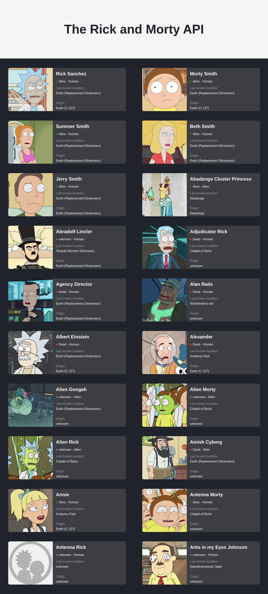

<h1 align="center"><strong>The Rick & Morty Website</strong></h1>

This Website is made with  ❤️ <strong>React </strong>

##Live Demo

## Code Style

## Tech/framework used

<b>Built With</b>

- [React](https://reactjs.org/) <code></code>
- [nodejs](https://nodejs.org/en/) <code></code>

## Screenshots

|

## How to use?

### `npm run`

It will install all node pakages for you

In the project directory, you can run:

### `npm start`

Runs the app in the development mode. 
Open [http://localhost:3000](http://localhost:3000) to view it in the browser.

The page will reload if you make edits. 
You will also see any lint errors in the console.

## Credits

Thank you for the API [Rick and Morty API](https://rickandmortyapi.com/)
